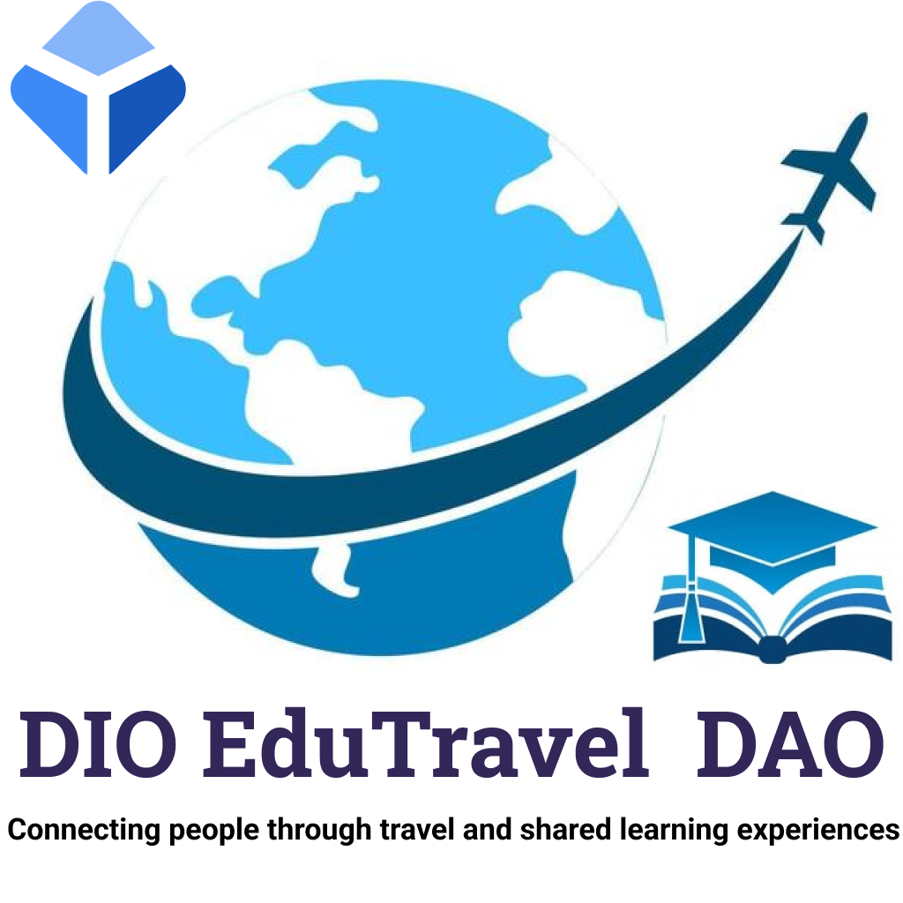

# Join the DIO EduTravel DAO Revolution!

**Do you love to learn and travel? Want to be part of a global community that shares knowledge and experiences? Join DIO EduTravel DAO and embark on a journey of discovery and growth!**

## About DIO EduTravel DAO

DIO EduTravel DAO is an autonomous, decentralized organization that unites travel and learning enthusiasts from around the world. Our mission is to connect people through educational experiences and enriching travel. Whether you're a culture lover, a curious explorer or someone looking for new perspectives, DIO EduTravel DAO is the place for you.

## What we offer

- **Experience Sharing:** Share your travel and learning adventures with a passionate global community.
- **Learning Programs:** Explore cultural courses, language exchanges and unique educational opportunities.
- **Travel Discounts:** Access special discounts on trips and experiences offered by our network of partners.
- **Active Participation:** Be part of DAO's decisions, influencing future destinations and programs.

## How to participate

1. **Purchase DETDAO Tokens:** Participate in our Initial Coin Offering (ICO) to purchase DIO EduTravel Coins (ETC) and become an active member.
2. **Share Experiences:** Share your own learning and travel stories to enrich the community.
3. **Vote and Contribute:** Vote for proposals and help shape the future adventures of DIO EduTravel DAO.
4. **Explore and Learn:** Explore educational opportunities and travel that expand horizons.

## How to participate

Join us now and be part of a global learning revolution! [Click here](link_to_join) to join the DIO EduTravel DAO.

    

Connect with us on [Twitter](link_para_twitter) and [Instagram](link_para_instagram) to keep up with the latest news and amazing stories from our community!

*Find it out. Learn it. Explore. Together, we go beyond borders.*